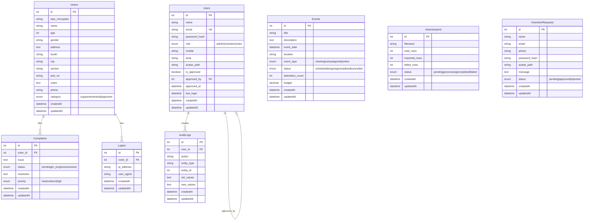

# MyNeta - Entity Relationship Diagram

## Database ERD

## Relationships Summary

| Parent | Child | Relationship | Description |
|--------|-------|--------------|-------------|
| **Users** | AuditLogs | 1:N | User actions are logged |
| **Users** | Users | 1:1 (self) | Admin approves volunteers |
| **Voters** | Complaints | 1:N | Voter files complaints |
| **Voters** | Logins | 1:N | Voter login history |

## Entity Descriptions

### Users
Central user table for all authenticated users (admins, volunteers, voters who register).

### Voters  
Voter database containing voter roll information. Not linked to Users - these are constituents, not system users.

### Complaints
Issues/complaints filed by voters, tracked through resolution workflow.

### Events
Campaign events like meetings, rallies, door-to-door campaigns.

### AuditLogs
Tracks all user actions for accountability and debugging.

### Logins
Records voter login attempts (for public portal).

### VotersImports
Tracks bulk imports of voter data from Excel files.

### VolunteerRequests
Pending volunteer registration requests awaiting admin approval.

---

## Cardinality Notation

| Symbol | Meaning |
|--------|---------|
| `\|\|` | Exactly one |
| `o\|` | Zero or one |
| `\|{` | One or many |
| `o{` | Zero or many |
