# MyNeta - Use Case Diagram

## System Use Cases

```mermaid
graph TB
    subgraph Actors
        Admin((Admin))
        Volunteer((Volunteer))
        Voter((Voter))
    end

    subgraph "Authentication"
        UC1[Login]
        UC2[Logout]
        UC3[Register Account]
    end

    subgraph "Voter Management"
        UC4[View Voters]
        UC5[Add Voter]
        UC6[Edit Voter]
        UC7[Delete Voter]
        UC8[Categorize Voter]
        UC9[Search Voters]
        UC10[Import Voters from Excel]
    end

    subgraph "Complaint Management"
        UC11[View Complaints]
        UC12[Add Complaint]
        UC13[Update Complaint Status]
        UC14[Delete Complaint]
        UC15[Filter Complaints]
    end

    subgraph "Event Management"
        UC16[View Events]
        UC17[Create Event]
        UC18[Edit Event]
        UC19[Delete Event]
    end

    subgraph "Volunteer Management"
        UC20[View Volunteers]
        UC21[Approve Volunteer]
        UC22[Reject Volunteer]
        UC23[Deactivate Volunteer]
        UC24[Apply as Volunteer]
    end

    subgraph "Dashboard & Reports"
        UC25[View Dashboard Stats]
        UC26[View Charts]
        UC27[Generate Reports]
    end

    %% Admin connections
    Admin --> UC1
    Admin --> UC2
    Admin --> UC4
    Admin --> UC5
    Admin --> UC6
    Admin --> UC7
    Admin --> UC8
    Admin --> UC9
    Admin --> UC10
    Admin --> UC11
    Admin --> UC12
    Admin --> UC13
    Admin --> UC14
    Admin --> UC15
    Admin --> UC16
    Admin --> UC17
    Admin --> UC18
    Admin --> UC19
    Admin --> UC20
    Admin --> UC21
    Admin --> UC22
    Admin --> UC23
    Admin --> UC25
    Admin --> UC26
    Admin --> UC27

    %% Volunteer connections
    Volunteer --> UC1
    Volunteer --> UC2
    Volunteer --> UC4
    Volunteer --> UC9
    Volunteer --> UC11
    Volunteer --> UC12
    Volunteer --> UC15
    Volunteer --> UC16
    Volunteer --> UC25

    %% Voter connections
    Voter --> UC1
    Voter --> UC2
    Voter --> UC3
    Voter --> UC12
    Voter --> UC24
    Voter --> UC25
```

---

## Use Cases by Actor

### Admin (Full Access)
| ID | Use Case | Description |
|----|----------|-------------|
| UC1 | Login | Authenticate with email/password |
| UC2 | Logout | End session |
| UC4-UC10 | Voter CRUD | Complete voter management |
| UC11-UC15 | Complaint CRUD | Full complaint lifecycle |
| UC16-UC19 | Event CRUD | Create and manage events |
| UC20-UC23 | Volunteer Mgmt | Approve, reject, deactivate volunteers |
| UC25-UC27 | Reports | View stats, charts, generate reports |

### Volunteer (Limited Access)
| ID | Use Case | Description |
|----|----------|-------------|
| UC1 | Login | Authenticate (after approval) |
| UC2 | Logout | End session |
| UC4, UC9 | View/Search Voters | Read-only access to voter data |
| UC11, UC12, UC15 | Complaints | View, add, filter complaints |
| UC16 | View Events | See upcoming events |
| UC25 | Dashboard | View basic statistics |

### Voter / Public User
| ID | Use Case | Description |
|----|----------|-------------|
| UC1 | Login | Access public portal |
| UC2 | Logout | End session |
| UC3 | Register | Create account |
| UC12 | Add Complaint | File a complaint |
| UC24 | Apply as Volunteer | Submit volunteer application |
| UC25 | View Dashboard | See public statistics |

---

## Natural Language Description

**Admin can:**
- Manage all voters (add, edit, delete, categorize, import)
- Handle all complaints (create, update status, delete)
- Manage all events (create, edit, delete)
- Approve or reject volunteer applications
- View comprehensive dashboards and reports

**Volunteer can:**
- View and search voter database (read-only)
- Add complaints on behalf of voters
- View events and basic dashboard

**Voter/Public can:**
- Register and login
- File complaints
- Apply to become a volunteer
- View public dashboard
